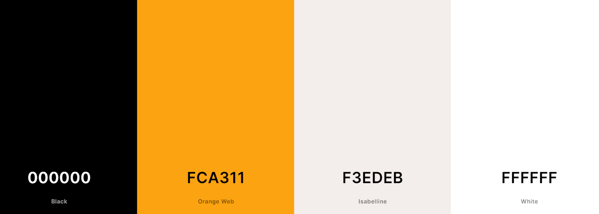

# Freedom Fighter's

Freedom fighter website is a simple-to-use website aimed at giving a brief introduction to Indian freedom fighters and their contribution, on the second page of the freedom fighter's website is named History of India. you will find the evolution of the Indian flag and a brief introduction to Indian achievements. to know more about Indian history and freedom fighters you can refer to resources and you can contact us.

[Visit the Freedom fighter's live website here](https://8000-dhvaniintwa-indiaindepe-rl8qyhlukai.ws-eu79.gitpod.io/home.html)

# Table of Contents
----
 ### [Purpose](#Purpose)

 ### [Design](#Design)
   - [Color scheme](#colour-scheme)
   - [Fonts](#Fonts)

 ### [Features](#features)

 - [Existing Features](#existing-features)
    - [Homepage](#homepage)
    - [History of India](#history-of-India )
    - [Resources](#resources)
    - [Contact](#contact)
    - [Thank You](#thank-you)

- [Accessibility](#accessibility)

### [Technologies](#technologies)

### [Testing](#testing)

### [Credits](#credits-1)
- [References](#references)
- [Acknowledgements](#acknowledgements)

 

----

 

### **Purpose**
The Purpose of this website is to make the user more aware of the contribution made by Indian freedom fighters to get freedom from British rule in India and to make aware of how Indian flags have been changing over the years the user can also have a summary of few achievements of India after Independence. Moreover, to make the website user-friendly, the reader can also watch the Indian anthem on our website and if the reader whats to explore more about India, its culture, and its History many website and links are also provided.

 

----
## Design
### **colour Scheme**

This website uses a palette of colours with shades pulled from white,Orange and black. These embody I wanted to create for the site because it looks pleasing to the eyes. The palette was created using the [Coolors](https://coolors.co/) website.

## **Fonts**

[Google Fonts](https://fonts.google.com/) was used to source the font styles used throughout the website:
- Pacifico, cursive:  page/section headings
- sans-serif: Used for main body text and the logo 

These fonts were chosen to be in keeping with the style of the website; clean and simple. They were also chosen to ensure maximum accessibility.

## Features
### **Existing Features**
The website has four main pages which are accessible to the users, which are the home page, History of India page, Resources, and Contact page. There is also a thank you page which only appears when the user submits the contact form.

- All pages include the features Logo, navigation bar, and footer.
   - Logo: The Logo of Indian Freedom fighters gives the user a clear idea of what this website is all about. Here is the Logo shown below.

   

   - Navigation bar: The navigation menu allows users to move through the different pages on the website. Navigation links are to the right side: History , Resources, and Contact.

    

    - Footer: 
        - The footer contains three universally recognized icons for social media: Facebook, Youtube, and Twitter. 
        - Social media icon links will open a new tab to allow easy navigation for the users.

     

-  Here is a short preview of how a website looks on a mobile device.

### Homepage

The homepage gives users a glimpse of Indian Freedom Fighters through a large photo.
- After the image, there are short descriptions of the Indian independence movement.
- Thereby the users will follow brief introductions of the top six Indian Freedom Fighters.

 

### Historypage

The History of India page consists of the simple layout of boxes. The webpage is being divided into three sections. The first section represents Timeline of the Indian flag. The second section describes about Indian historical achievements in different sector's followed by the third section of the youtube video - Indian National Anthem

### Rescources

If the user wants to know about India, the user can go to the resources page where a few books and movies about Indian Freedom fighters are recommended. Moreover, at the end of the resources page, there are a few website links which the user can explore if He / She wants to know more about India.

### Contact

This page will allow the user to contact us if He / She want's to know more about freedom fighters of India. The webpage has a Contact Form where the user will be asked to submit their name, email address  along with the message. Additionally, they can contact us via Telephone, Email or by Post. 

At the end of the page there is a Google Map.

### Thank You

This page will appear when the user will submit the contact form where a Thank you message will be displaced, confirming to the user that their message has been submitted, and that someone will be in touch with them soon.

 

### **Accessibility**

For the Best user experience having an accessible website is most important.

Therefore I have used simple font styling so that the user can read easily. Also the contrast between the background and foreground color also meet good accessibility.The website is designed in such a way that the foreground information is never distracted by backgrounds.

Addition of a fixed menu bar so users can easily navigate around the site. The website is made by Using semantic HTML. Ensuring all images have an alt description for screen readers or where the image cannot be loaded. 

## Technologies
### **Languages Used**
This website has been written in HTML and CSS and a little bit of JavaScript.

**Frameworks, Libraries, and Programs Used**
- GitHub: Storing and hosting my code/repositories
- Gitpod: Code editor for writing my code and storing other images/files
- Font Awesome: For icons used throughout the site
- Google Fonts: To import the fonts used throughout the site
- Coolors: Colour palette picking website used to       choose my color scheme
- Snipping Tool: To crop and screenshot images
- [TinyPNG](https://tinypng.com/)  To compress images
- [Convertio](https://convertio.co/)  To convert Jpg image to Webp
- [Techsini](https://techsini.com/multi-mockup/)  For Responsive Website

