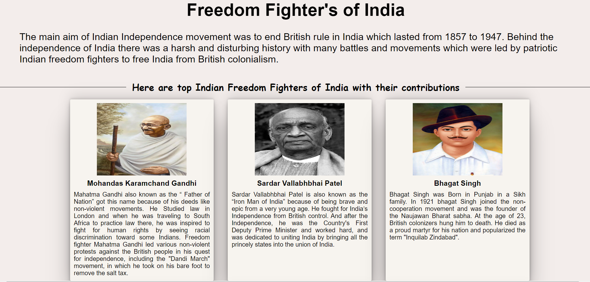
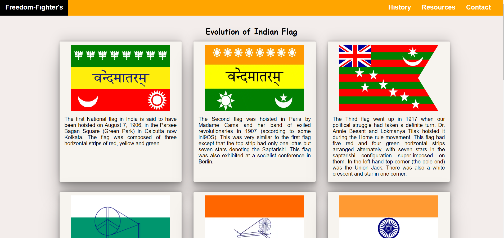
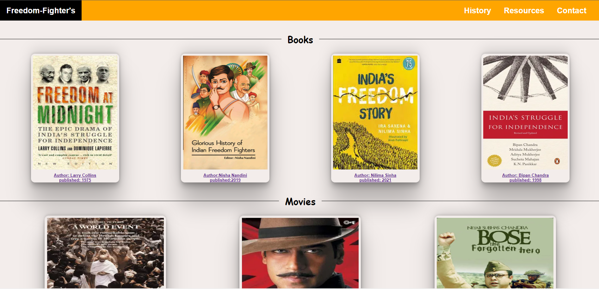
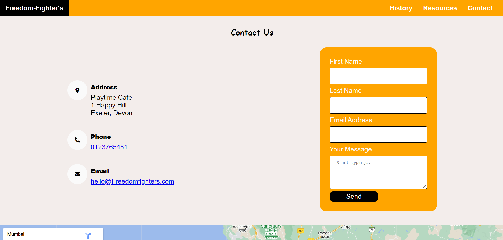

# Freedom Fighter's

Freedom fighter website is a simple-to-use website aimed at giving a brief introduction to Indian freedom fighters and their contribution, on the second page of the freedom fighter's website is named History of India. you will find the evolution of the Indian flag and a brief introduction to Indian achievements. to know more about Indian history and freedom fighters you can refer to resources and you can contact us.

[Visit the Freedom fighter's live website here](https://8000-dhvaniintwa-indiaindepe-rl8qyhlukai.ws-eu79.gitpod.io/home.html)

# Table of Contents
----
 ### [Purpose](#Purpose)

 - [Design](#Design)
    - [imagery](#imagery)
    - [Color scheme](#colour-scheme)
    - [Fonts](#Fonts)

 ### [Features](#features)

 - [Existing Features](#existing-features)
    - [Homepage](#homepage)
    - [History of India](#history-of-India )
    - [Resources](#resources)
    - [Contact](#contact)
    - [Thank You](#thank-you)
- [Accessibility](#accessibility)
- [Future Features](#future-features)

### [Technologies](#technologies)

### [Version Control](#version-control)

### [Credits](#credits-1)
- [Resources](#resources)
- [Acknowledgements](#acknowledgements)

 

----

 

### **Purpose**
The Purpose of this website is to make the user more aware of the contribution made by Indian freedom fighters to get freedom from British rule in India and to make aware of how Indian flags have been changing over the years the user can also have a summary of few achievements of India after Independence. Moreover, to make the website user-friendly, the reader can also watch the Indian anthem on our website and if the reader whats to explore more about India, its culture, and its History many website and links are also provided.

 

----

 

## Features
### **Existing Features**
The website has four main pages which are accessible to the users, which are the home page, History of India page, Resources, and Contact page. There is also a thank you page which only appears when the user submits the contact form.

- All pages include the features Logo, navigation bar, and footer.
   - Logo: The Logo of Indian Freedom fighters gives the user a clear idea of what this website is all about. Here is the Logo shown below.

   

   - Navigation bar: The navigation menu allows users to move through the different pages on the website. Navigation links are to the right side: History , Resources, and Contact.

    

    - Footer: 
        - The footer contains three universally recognized icons for social media: Facebook, Youtube, and Twitter. 
        - Social media icon links will open a new tab to allow easy navigation for the users.

     

-  Here is a short preview of how a website looks on a mobile device.

### Homepage
The homepage gives users a glimpse of Indian Freedom Fighters through a large photo.
- After the image, there are short descriptions of the Indian independence movement.
- Thereby the users will follow brief introductions of the top six Indian Freedom Fighters.

 

### Historypage

The History of India page consists of:
- The simple layout of boxes. It is being divided into three sections the first section represents the Evolution of the Indian flag. the second section represents the historical achievements of India followed by the third section of the youtube video Indian National Anthem

### Rescources
On the resources page the user will:
- If the user wants to know about India, the user can go to the resources page where a few books and movies about India. Freedom fighters are recommended, moreover, at the end of the resources page, there are a few website links to know more about India.

### Contact

This page consists of:

- This page will allow the user to contact to take more information about freedom fighters of India and know more about India. The user will be asked to submit their name, and email address  along with the inquiry text. Additionally, they can contact us via Telephone or Email.

- Google Maps: A google map of the Exeter area is included

### Thank You
This page consists of:
- A thank you message confirming to the user that their message has been submitted and that someone will be in touch with them soon.

 

### **Accessibility**

