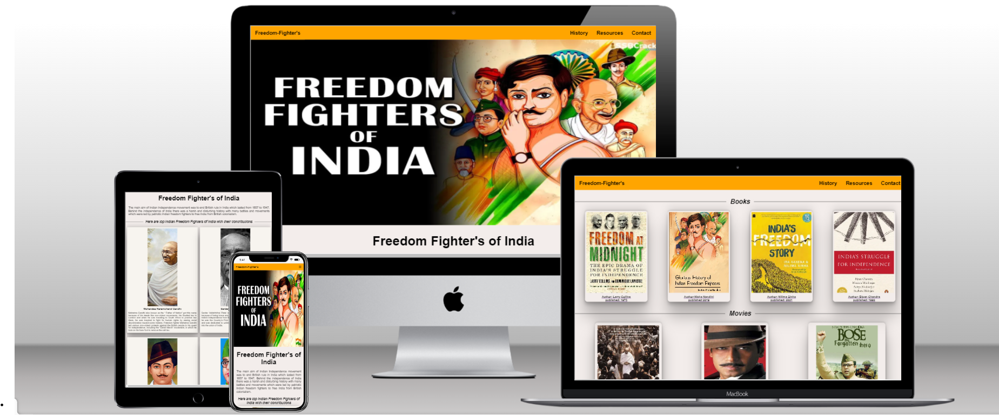
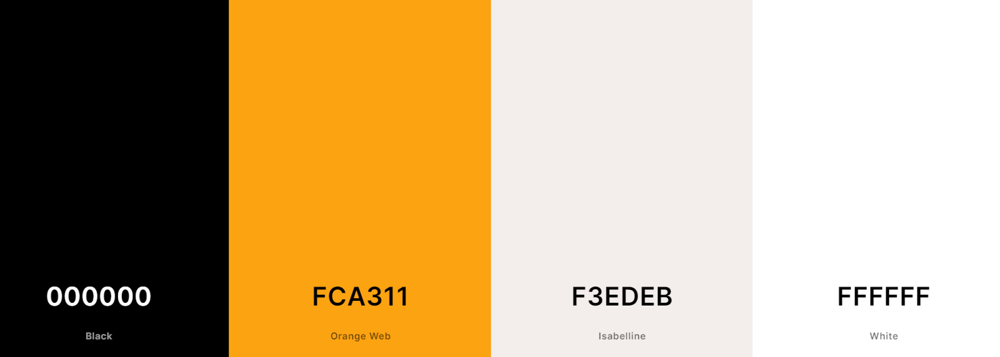
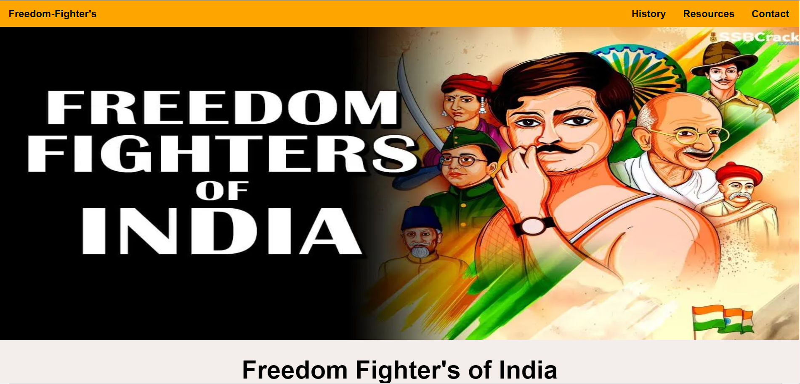
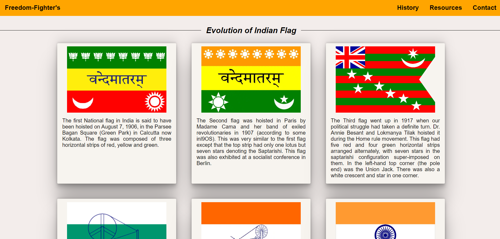
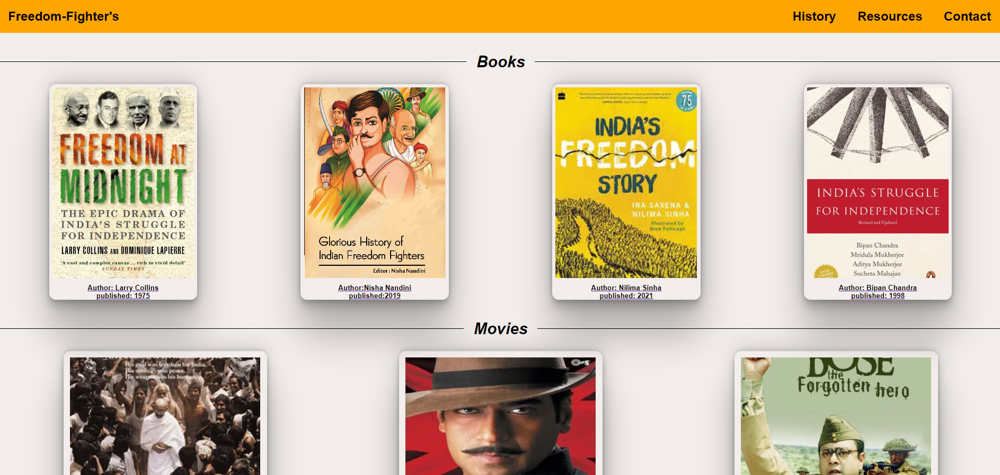
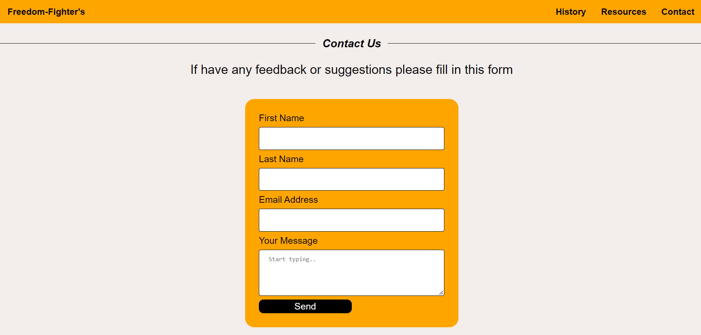
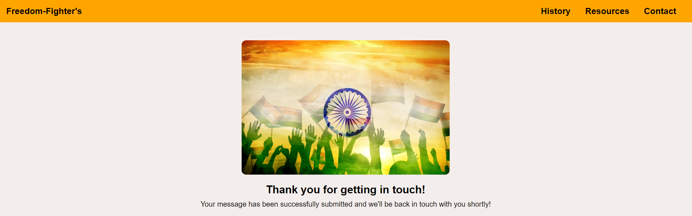
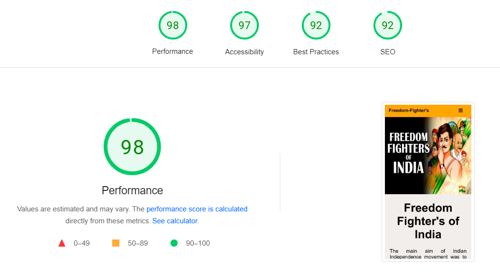
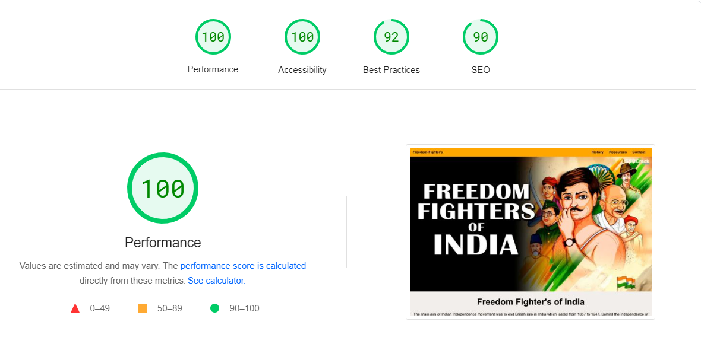

# Freedom Fighter's

Freedom fighter website is a simple-to-use, informative website aimed at giving a brief introduction to Indian freedom fighters and their contribution, about the History of the Indian National Flag, and about Indian achievements after Independence. Moreover, the User can also find books, movies, and resource links if the user wants to know more about India's history and culture. It provides also an option to the user for any feedback or suggestion about Freedom Fighters via the contact form.

[Visit the Freedom fighter's live website here](https://8000-dhvaniintwa-indiaindepe-rl8qyhlukai.ws-eu79.gitpod.io/home.html)

## Table of Contents
----

### [Design](#design-1)

   - [Colour scheme](#colour-scheme)
   - [Fonts](#fonts)

### [Features](#features-1)

 - [Existing Features](#existing-features)
    - [Home page](#homepage)
    - [History page](#historypage)
    - [Resources page](#resourcespage)
    - [Contact page](#contactpage)
    - [Thank-You page](#thank-you-page)
 - [Accessibility](#accessibility)

 ### [Technologies](#technologies-1) 

### [Deployment](#deployment-1)
 
 ### [Testing](#testing-1)
   - [Function Testing](#function-testing)
   - [Lighthouse](#lighthouse)
   - [Validator Testing](#validator-testing)

### [Credits](#credits-1)

### [References](#references-1)
 
### [Acknowledgements](#acknowledgements-1)

 

----
## Design
### **Colour Scheme**

This website uses a palette of colours with shades pulled from white,Orange and black. These embody I wanted to create for the site because it looks pleasing to the eyes. The palette was created using the [Coolors](https://coolors.co/) website.

## **Fonts**

[Google Fonts](https://fonts.google.com/) was used to source the font styles used throughout the website:
- italic : section headings
- sans-serif : Used for main body text and the logo 

These fonts were chosen to be in keeping with the style of the website; clean and simple. They were also chosen to ensure maximum accessibility.

## Features
### **Existing Features**
The website has four main pages which are accessible to the users, which are the home page, history of India page, Resources page, and Contact page. There is also a thank you page which only appears when the user submits the contact form.

- All pages include the features Logo, navigation bar, and footer.
   - Logo: The Logo of Indian Freedom fighters gives the user a clear idea of what this website is all about. Here is the Logo shown below.

   

   - Navigation bar: The navigation menu allows users to move through the different pages on the website. Navigation links are to the right side: history , resources, and contact.And on the left side there is website logo , clicking on the logo will take the user to the home page. 

    

    - Footer: 
        - The footer contains three universally recognized icons for social media: Facebook, Youtube, and Twitter. 
        - Social media icon links will open a new tab to allow easy navigation for the users.

     

-  Here is a short preview of how a website looks on a mobile device.
    
    
   

### Homepage

The homepage gives users a glimpse of Indian Freedom Fighters through a large photo.
After the image, there are short descriptions of the Indian independence movement. Thereby the users will follow brief introduction of the top six Indian Freedom Fighters.

 

### Historypage

The History of India page consists of the simple layout of boxes. The webpage is being divided into three sections. The first section represents timeline of the Indian flag. The second section describes about Indian historical achievements in different sector's followed by the third section of the youtube video - Indian National Anthem

### Resourcespage

If the user wants to know about India, the user can go to the resources page where few books and movies about Indian Freedom fighters are recommended. Moreover, at the end of the resources page, there are a few website links which the user can explore if He / She wants to know more about India.

### Contactpage

If the user have any feedback or suggestions the user can feel the contact form .In this webpage the user will be asked to submit their name, email address along with their message.

### Thank-you-page

This page will appear when the user will submit the contact form where a Thank you message will be displaced, giving a confirming meassage to the user that their message has been submitted, and that someone will be in touch with them soon.

 

### **Accessibility**

For the Best user experience having an accessible website is most important. Therefore, I have used simple font styling so that the user can read easily. Also the contrast between the background and foreground color also meet good accessibility.The website is designed in such a way that the foreground information is never distracted by backgrounds.

Addition of a fixed menu bar so users can easily navigate around the site. The website is made by Using semantic HTML. Ensuring all images have an alt description for screen readers or where the image cannot be loaded. 

## Technologies
### **Languages Used**

This website has been written in HTML and CSS and a little bit of JavaScript.

**Frameworks, Libraries, and Programs Used**

- GitHub: Storing and hosting my code/repositories
- Gitpod: Code editor for writing my code and storing other images/files
- Font Awesome: For icons used throughout the site
- Google Fonts: To import the fonts used throughout the site
- Coolors: Colour palette picking website used to choose my color scheme
- Snipping Tool: To crop and screenshot images
- [Gyazo](https://gyazo.com): To make gif
- [TinyPNG](https://tinypng.com/): To compress images
- [Convertio](https://convertio.co/): To convert Jpg image to Webp
- [Techsini](https://techsini.com/multi-mockup/): For Responsive Website

## Testing

Testing was performed across a range of devices, including:

- all website pages have been tested on different browsers: Chrome, Edge, and Safari.
- When a nav element is clicked, it provides the navigation link to the respective page.
- the responsiveness of the website on different screen sizes (Mobile S-320px, Mobile M-375px, Mobile L-425px, Tablet-768px,     
  Laptop-1024px) using the Devtools service toolbar. The different CSS properties for font, color, background color, links, submit button work as expected.
- Inside the footer, social media is linked when clicked on it. The link directs to the respective social media page.

### **Function Testing**

| Page | Test | Successfully Completed |
| :----| :---| :----------------------:|
| All  | Logo text links back to homepage | Yes |
| All  | Navigation links go to relevant page | Yes |
| All  | Navigation menu remains fixed at top of page on scroll | Yes |
| All  | Social media icons in footer link to external sites, opening in new tabs | Yes |
| All  | External links open to correct page | Yes |
| Homepage  | Grid is responsive | Yes |
| History  |  Box flex responsively | Yes |
| Histoty  | Embedded YouTube video is responsive | Yes |
| Resources | Box flex responsively |yes|
| Contact  | Required elements are active on the form | Yes |
| Contact  | Submit button directs to thank you page | Yes |

 

### **Lighthouse**

   - Lighthouse test for Mobile
    
   
   - Lighthouse test for Desktop
   

### Validator Testing 

No error was returned when passing through the official website for all the pages:

  -  index.html [W3C validator](https://validator.w3.org/nu/?doc=https%3A%2F%2F8000-dhvaniintwa-indiaindepe-rl8qyhlukai.ws-eu80.gitpod.io%2Findex.html)
  -  history.html [W3C validator](https://validator.w3.org/nu/?doc=https%3A%2F%2F8000-dhvaniintwa-indiaindepe-rl8qyhlukai.ws-eu80.gitpod.io%2Fhistory.html)
  - resources.html [W3C validator](https://validator.w3.org/nu/?doc=https%3A%2F%2F8000-dhvaniintwa-indiaindepe-rl8qyhlukai.ws-eu80.gitpod.io%2Fresources.html)
  - contact.html [W3C validator](https://validator.w3.org/nu/?doc=https%3A%2F%2F8000-dhvaniintwa-indiaindepe-rl8qyhlukai.ws-eu80.gitpod.io%2Fcontact.html)
  - thanks.html [W3C validator](https://validator.w3.org/nu/?doc=https%3A%2F%2F8000-dhvaniintwa-indiaindepe-rl8qyhlukai.ws-eu80.gitpod.io%2Fthankyou.html%3Ffname%3Ddhvani%26lname%3Dintwala%26email%3Dintdhvani2627%2540gmail.com)

   

  ## Credits
  ### **References**

  Some of the texts and images  for the Home page and Our History page was taken from different search results from Google/Bing.

  - References for images:
      - Index page:
         - [Mohandas Karamchand Gandhi](https://www.themaestroart.com/portraits/mahatma-gandhi/)
         - [Sardar Vallabhbhai Patel](https://de.wikipedia.org/wiki/Vallabhbhai_Patel#/media/Datei:Sardar_patel_(cropped).jpg)
         - [Bhagat Singh](https://www.pinterest.de/pin/592716000938883290/)
         - [Subhas Chandra Bose](https://www.pinterest.de/pin/804807395914552955/)
         - [Rani-Lakshmibai](https://skillpundit.com/rani-lakshmibai.php)
         - [Jawaharlal Nehru](https://de.wikipedia.org/wiki/Jawaharlal_Nehru)
        
      - History page:
         - Indian flag [1906](https://www.wionews.com/photos/significance-and-evolution-of-the-indian-national-flag-315131)
         - Indian flag [1907](https://www.rediff.com/news/special/the-tiranga-from-1906-to-1947/20220812.htm#:~:text=The%20first%20national%20flag%20to,the%20Devnagri%20inscription%2C%20Vande%20Mataram.)
         - Indian flag [1917](https://www.rediff.com/news/special/the-tiranga-from-1906-to-1947/20220812.htm#:~:text=The%20first%20national%20flag%20to,the%20Devnagri%20inscription%2C%20Vande%20Mataram.)
         - Indian flag [1921](https://timesofindia.indiatimes.com/100-years-ago-national-flag-took-shape/photostory/81773867.cms)
         - Indian flag [1931](https://timesofindia.indiatimes.com/100-years-ago-national-flag-took-shape/photostory/81773867.cms)
         - Indian flag [1947](https://timesofindia.indiatimes.com/100-years-ago-national-flag-took-shape/photostory/81773867.cms)

      - More References:
         - [Achivements](https://www.youtube.com/watch?v=xZ-3BIKbjtE)
         - [India national symbols](https://www.psgtech.edu/ncc/03Symbols.html)
         - [India flags timeline](https://www.reddit.com/r/vexillology/comments/j41tlv/timeline_of_all_flags_of_india/)
         - [Freedom fighter's of India](https://www.studyiq.com/articles/freedom-fighters-of-india/)
         - [Story of India](https://www.pbs.org/thestoryofindia/resources/books/)
         - [Freedom Fighters](https://businesstalkmagazine.com/blog/top-10-freedom-fighters-of-india/)
         
  ### **Acknowledgements**

  At first, I would like to thank my mentor Akshat Garg for helping me during my First project with HTML and CSS by providing good guidance and suggesting things which has helped me in eliminating bugs and making a good website. With my commitment and positive approach, not only I completed my First project but had also learned many new cool stuffs in making websites. Moreover, I would also like to thank Slack Team who were always there to keep me motivated throughout my project.

